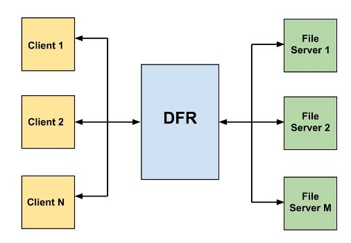

DISTRIBUITED FILE REPOSITORY
============================

Legend
------
				    
DFR -> Distribuited File Repository
FS  -> File Server	
CL  -> Client

Description
-----------
 -----------
The project realize a file distribuited repository. It is composed by the
following components:
* DFR 
* FS
* CL

DFR
-----------
It is a multithread process which implements the repository's abstraction,
accept connection from CL and FS. The CLs request a file to DFR and if is it
(the file) available the DFR tell him about the FS which has the file. The FS
can register on DFR their file in order to make them available.

FS
-----------
It's a multithread process, it handles the client's requests and communicate 
with the DFR to register o deregister his files.

CL
-----------
It requests a file to the DFR and if is it available make a request to the 
relative FS.

How to compile
--------------
 --------------
Using a shell go to the root directory and type :
	
		make

When it ends you can find the executables in the directories in "bin" 
(directory).

It's possible to compile specific modules using :

		make dfr
		make fs
		make cl

How to use
----------
 ----------

DFR

		./DFR <port for FSs> <port for CLs>

FS

		./FS <ip DFR> <port DFR> <ip to CL's requests> <port for CL> 
		<max number of cl it must handle> <file1> <max cl for file1>
		<file2> <max cl for file2> ....

CL

		./CL <ip DFR> <port DFR> <mode> <file to be requested> 

The parameter "mode" is used to the tests.

TEST
-----
 -----

The directory "test" there is a script used to execute one of 2 available tests. 
To execute one of the tests type in the shell :

		./test

At the end of test the you can find the file downloaded by the CLs in test/CL.

The script "reset" will be executed every time you start a test, it is used to 
remove the files created in previous test.

!!!ATTENTION!!!

The first time you want execute a test you must execute the setup script :
	
		./setup

this creates the directories and copy the executable files in the test directory.

Test 1 
------
There are 2 FS, each one specify 3 files (one of them is the same for the FS), 
for each file they can handle only 2 CL. 10 CL try, periodically, to access at
the common file.

Test 2
------
10 CL request to be notified when a certain file, that currentely doesn't exist,
is registered by some FS. After that a FS register the file for a max of 3 CL. 
Every CL is notified.

Problems
--------
 --------

P - Scripts aren't executable.

S - Use :
		chmod +x <nome file> 

Other INFORMATIONS are available in the documentation, open the file index.html
 in doc directory.

Author
------
 ------
Alessandro Pischedda

Contact
-------
 -------
alessandro.pischedda@gmail.com
